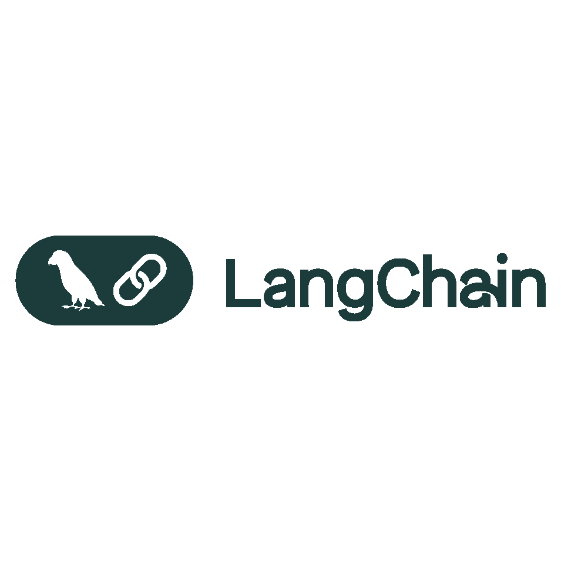

<!-- Logo -->

  

This project is licensed under the [MIT License](LICENSE).

# Cookbooks

_A curated collection of code snippets, notebooks, and best practices for building powerful, context-rich applications with LangGraph and LangSmith._

## Table of Contents
- [Cookbooks](#cookbooks)
  - [Table of Contents](#table-of-contents)
  - [Repository Structure](#repository-structure)
  - [Purpose](#purpose)

## Repository Structure

- **langgraph/**: Contains modules and examples related to LangGraph, including:
  - **architectures/**: Architectural patterns and examples.
  - **human-in-the-loop/**: Examples involving human interaction.
  - **persistence/**: Persistence and data storage patterns.
  - **streaming/**: Streaming data and real-time processing examples.

- **langsmith/**: Contains modules and examples related to LangSmith, including:
  - **evaluation/**: Evaluation techniques and examples.
  - **observability/**: Observability and tracing examples, including:
    - **tracing/otel/**: OpenTelemetry tracing examples.
  - **prompt-engineering/**: Prompt engineering patterns and examples.

## Purpose

This repository serves as a comprehensive guide for developers looking to implement advanced features and design patterns using LangGraph and LangSmith. It aims to provide practical examples and best practices to facilitate the development of robust applications.
