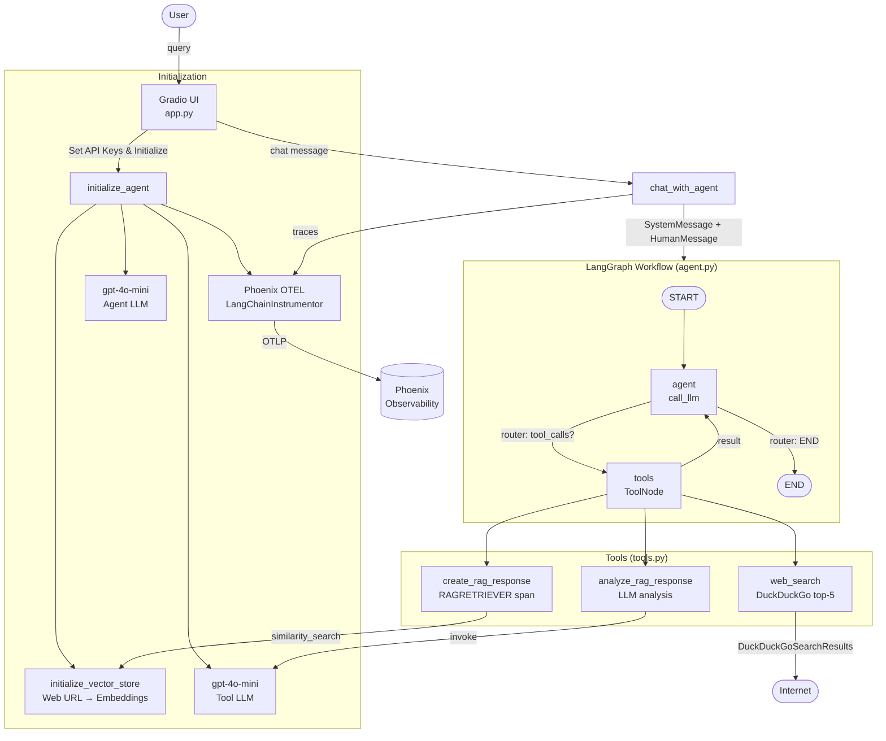

# Agentic RAG Examples

## Overview

This folder contains examples for building a Retrieval-Augmented Generation (RAG) agent using the LangChain library.

## Features

* Construction of a RAG agent workflow using LangChain
* Integration with OpenAI models for language generation and retrieval
* Example usage of tools such as web search and response analysis, create rag response
* Auto-instrumentation with OpenInference decorators to fully instrument the agent
* End-to-end tracing with Phoenix to track agent performance

## Requirements

* LangChain library
* OpenAI API key
* Langgraph
* Python 3.x
* Gradio (for UI)

## Installation

1. Install the required libraries by running `pip install -r requirements.txt`
2. Run app.py and input the required Keys(OpenAI, Phoenix API Key)

## Usage

1. Run the `app.py` script to start the RAG agent
2. Interact with the agent by providing input and receiving responses

## Files

* `app.py`: The main script for starting the application, this will run the web server with default port(7860)
* `agent.py`: The main script for the RAG agent
* `tools.py`: Contains tools for web search and response analysis, create rag response
* `rag.py`: Contains functions for initializing and using the RAG vector store
* `requirements.txt`: Lists the required libraries for the project

## Architecture



## E2E Test Chat Prompts

The default vector store is loaded from [Lilian Weng's post on LLM agents](https://lilianweng.github.io/posts/2023-06-23-agent/). Use the following prompts to exercise all tools and flows.

### Test 1 — RAG retrieval (happy path)
```
What is a LLM-powered autonomous agent?
```
*Expects: `create_rag_response` fires, answer drawn from vector store.*

### Test 2 — RAG retrieval (specific concept)
```
Explain the planning component of an agent system.
```
*Expects: RAG retrieves planning-related chunks, coherent answer returned.*

### Test 3 — RAG analysis tool
```
Analyze the RAG response you just gave me.
```
*Expects: `analyze_rag_response` fires with previous response, returns JSON with key_points, clarity, relevance, suggestions.*

### Test 4 — Web search fallback
```
What are the latest LLM agent frameworks released in 2025?
```
*Expects: RAG finds nothing current → `web_search` fires → DuckDuckGo results returned.*

### Test 5 — Tool chaining (RAG + web search)
```
What is ReAct prompting and are there any recent papers on it?
```
*Expects: `create_rag_response` retrieves ReAct content from the blog, then `web_search` supplements with recent papers.*

### Test 6 — Multi-turn memory
```
Turn 1: What is chain-of-thought prompting?
Turn 2: How does it differ from tree-of-thought?
Turn 3: Which one is more effective for multi-step reasoning?
```
*Expects: context from prior turns is preserved across all three messages (MemorySaver checkpoint).*

### Test 7 — Out-of-scope query (web search)
```
What is the current price of Bitcoin?
```
*Expects: RAG returns nothing relevant → `web_search` fires as fallback.*

### Test 8 — Analyze a web search result
```
Search for recent news about GPT-5, then analyze the response quality.
```
*Expects: `web_search` fires first, then `analyze_rag_response` evaluates the result.*

### Test 9 — Edge case: empty/vague query
```
Tell me something.
```
*Expects: agent still calls `create_rag_response`, gracefully returns something from the vector store or asks for clarification.*

### Test 10 — Long conversation context stress test
```
Turn 1: Summarize the entire blog post about LLM agents.
Turn 2: What were the key memory mechanisms described?
Turn 3: Now compare those to how humans store long-term memory.
Turn 4: Analyze the quality of your last response.
```
*Expects: all four turns flow correctly through RAG → LLM → analysis without state corruption.*

### Coverage summary

| Test | `create_rag_response` | `web_search` | `analyze_rag_response` | Multi-turn memory |
|------|-----------------------|--------------|------------------------|-------------------|
| 1    | ✓                     |              |                        |                   |
| 2    | ✓                     |              |                        |                   |
| 3    | ✓                     |              | ✓                      |                   |
| 4    | ✓                     | ✓            |                        |                   |
| 5    | ✓                     | ✓            |                        |                   |
| 6    | ✓                     |              |                        | ✓                 |
| 7    |                       | ✓            |                        |                   |
| 8    |                       | ✓            | ✓                      |                   |
| 9    | ✓                     |              |                        |                   |
| 10   | ✓                     |              | ✓                      | ✓                 |

## Notes

* All the Key's must be inputted from the UI application.
* RAG will be loaded with default url in the UI, You can update the url and initialize the project with your own data source.
* This application will support the HTML based sources. 