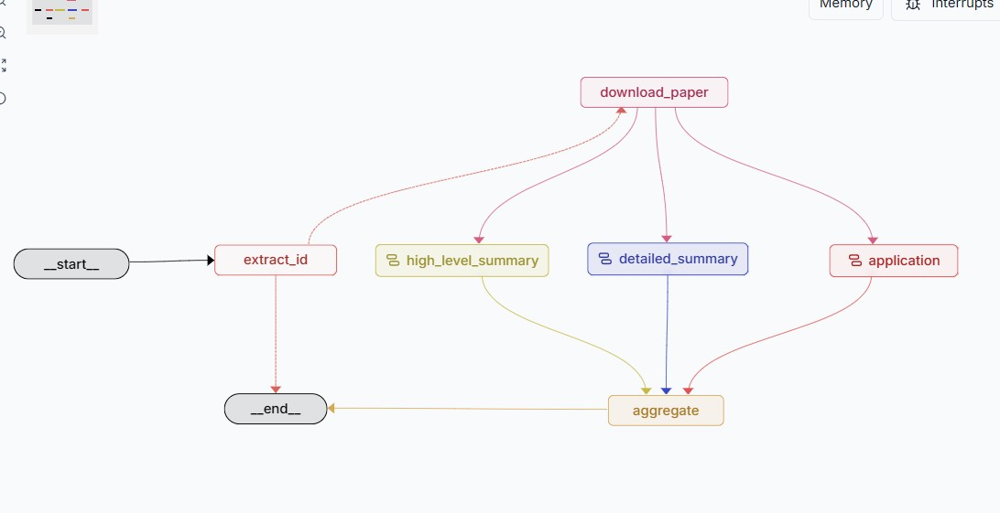

# arXiv Researcher Agent

A LangGraph agent that downloads and analyzes arXiv research papers and generates a comprehensive summary report with three types of analysis running in parallel.

## Overview

The agent accepts an arXiv URL or paper ID, downloads the full PDF text, and produces a structured report covering:
- High-level summary — plain-language overview for a general academic audience
- Detailed technical summary — methodology, experiments, results, and limitations
- Real-world applications — industry use cases and practical implementation considerations

## Graph Architecture



The workflow is a LangGraph `StateGraph` with the following execution flow:

### Nodes

| Node | Description |
|---|---|
| `__start__` | Entry point — receives the user message |
| `extract_id` | Parses the arXiv ID from the user's message using an LLM |
| `download_paper` | Downloads and extracts text from the arXiv PDF |
| `high_level_summary` | Sub-graph that generates a plain-language paper overview |
| `detailed_summary` | Sub-graph that generates a deep technical breakdown |
| `application` | Sub-graph that identifies real-world use cases |
| `aggregate` | Combines all three summaries into the final report |
| `__end__` | Exit point — outputs the final report to the chat |

### Execution Flow

1. `__start__` → `extract_id` — always runs first
2. `extract_id` → `__end__` — early exit if no arXiv ID found (dashed red line in graph)
3. `extract_id` → `download_paper` — proceeds if ID was successfully extracted
4. `download_paper` → `high_level_summary`, `detailed_summary`, `application` — **fan-out**: all three run in parallel
5. `high_level_summary`, `detailed_summary`, `application` → `aggregate` — **fan-in**: waits for all three to complete
6. `aggregate` → `__end__` — outputs the final Markdown report

The parallel execution means total latency is determined by the slowest of the three summary agents, not their sum.

### Shared State

All nodes communicate through a shared `State` TypedDict defined in `shared.py`:

```python
class State(TypedDict):
    messages: list[AnyMessage]   # conversation history
    arxiv_id: str                # extracted paper ID
    paper_content: str           # full PDF text
    high_level_summary: str      # output of high_level_summary node
    detailed_summary: str        # output of detailed_summary node
    applications: str            # output of application node
    final_report: str            # aggregated final report
```

## Project Structure

```
arxiv-researcher/
├── agent.py              # Main StateGraph workflow definition
├── shared.py             # State schema and shared OpenAI model
├── utils.py              # PDF download and text extraction (PyMuPDF)
├── agents/
│   ├── high_level_summary_agent.py   # Plain-language summary sub-graph
│   ├── detailed_summary_agent.py     # Technical summary sub-graph
│   └── application_agent.py         # Real-world applications sub-graph
├── prompts/
│   └── prompts.py        # Prompt templates for all three agents
├── langgraph.json        # LangGraph server configuration
└── requirements.txt      # Python dependencies
```

## Installation

1. Install dependencies:
```bash
pip install -r requirements.txt
```

2. Set up environment variables:
```bash
cp .env.example .env
```

Add the following to your `.env`:
```
OPENAI_API_KEY=your_key_here
LANGSMITH_API_KEY=your_key_here        # optional, enables tracing
LANGSMITH_TRACING=true
LANGSMITH_PROJECT=arxiv-researcher
LANGSMITH_ENDPOINT=https://api.smith.langchain.com
```

## Usage

### LangGraph Studio (recommended)

```bash
langgraph dev
```

Open the Studio URL printed in the terminal, then send a message with an arXiv URL:

```
https://arxiv.org/abs/1706.03762
```

### Programmatically

```python
import asyncio
from langchain_core.messages import HumanMessage
from agent import app

async def main():
    result = await app.ainvoke({
        "messages": [HumanMessage(content="https://arxiv.org/abs/1706.03762")]
    })
    print(result["final_report"])

asyncio.run(main())
```

## Tracing

LangSmith tracing is enabled automatically via environment variables — no code changes required. Set `LANGSMITH_API_KEY` and `LANGSMITH_TRACING=true` in your `.env` and all LLM calls and graph node executions will appear in your LangSmith project dashboard.

## Requirements

- Python 3.8+
- OpenAI API key
- LangGraph and LangChain dependencies
