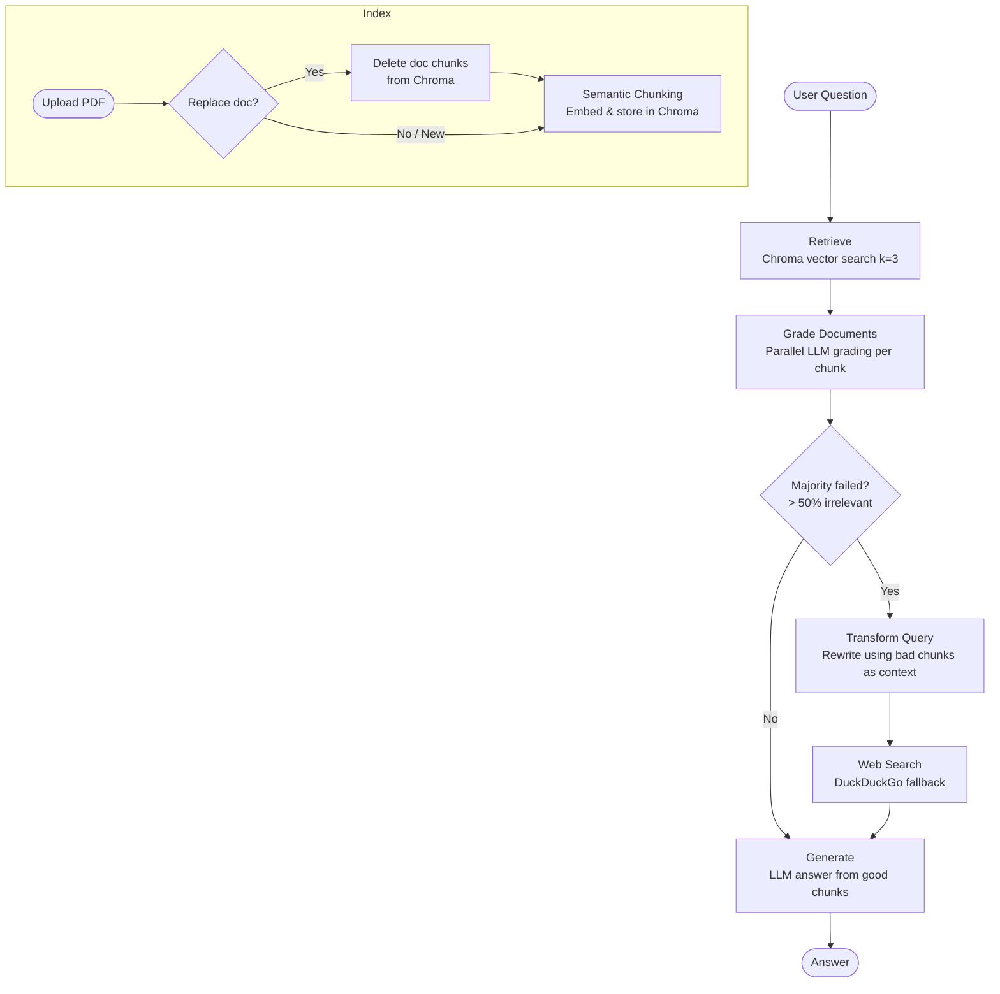

# Corrective RAG

An implementation of the [Corrective RAG paper](https://arxiv.org/pdf/2401.15884) using LangChain, LangGraph, and Streamlit.

The core idea: before generating an answer, every retrieved document chunk is graded for relevance. If the majority of chunks are irrelevant, the query is rewritten and a web search is performed as a fallback — correcting the retrieval before generation.

---

## Architecture



---

## Project Structure

```
corrective-rag/
├── streamlit_app.py        # UI entry point
├── graph.py                # LangGraph workflow definition
├── models/
│   ├── LLM.py              # LLM configuration (Gemini)
│   └── EM.py               # Embedding model configuration (Gemini)
├── nodes/                  # LangGraph node functions
│   ├── retrieve_node.py    # Fetches top-k chunks from Chroma
│   ├── grade_node.py       # Grades each chunk in parallel
│   ├── decision_node.py    # Routes to generate or correction branch
│   ├── transform_node.py   # Rewrites the query
│   ├── search_node.py      # Performs web search
│   └── generate_node.py    # Generates final answer
├── tools/                  # Reusable LangChain runnables
│   ├── index_tool.py       # Indexes PDFs into Chroma
│   ├── retrieve_tool.py    # Chroma retriever
│   ├── grade_tool.py       # Relevance grader (LLM + JSON output)
│   ├── transform_tool.py   # Question rewriter
│   ├── generate_tool.py    # RAG answer chain
│   └── search_tool.py      # DuckDuckGo search wrapper
└── index/
    └── chroma/             # Persisted Chroma vector store
```

---

## Graph Nodes

### `retrieve`
Embeds the user question and retrieves the top 3 most similar chunks from the Chroma vector store.

### `grade_documents`
Grades each retrieved chunk **in parallel** (via `ThreadPoolExecutor`) by sending the question + chunk to the LLM, which returns `{"score": "yes/no"}`. Chunks that pass are kept; failed chunks are counted.

**Correction threshold:** if more than 50% of chunks fail grading, `web_search` is flagged as `"Yes"`. This avoids triggering full correction when only one out of three chunks is irrelevant.

### `decide_to_generate`
Conditional edge. Routes to `transform_query` if web search is needed, otherwise directly to `generate`.

### `transform_query`
Rewrites the original question into a simpler, retrieval-optimized version using the LLM. The rewriter has access to the retrieved (bad) documents as context, so it can rewrite *away* from what didn't work.

### `web_search_node`
Runs a DuckDuckGo search with the rewritten query and appends the result as a new document to the context.

### `generate`
Formats all passing documents as context and streams the final answer from the LLM.

---

## Indexing

Documents are indexed using **semantic chunking** — splits happen at topic boundaries (measured by embedding cosine similarity between consecutive sentences) rather than at fixed token counts. This produces coherent, self-contained chunks that grade more accurately.

Each chunk is tagged with `source_filename` metadata, enabling **selective document replacement**: replacing a document deletes only its chunks from Chroma and re-embeds the new document — no other documents are re-processed.

---

## Models

| Component | Default | File |
|---|---|---|
| LLM | `gemini-2.5-flash` | `models/LLM.py` |
| Embeddings | `gemini-embedding-001` | `models/EM.py` |
| Web search | DuckDuckGo (free, no key) | `tools/search_tool.py` |

Both models can be swapped for any LangChain-compatible provider.

---

## Setup

### Prerequisites
- Python 3.12+
- [uv](https://docs.astral.sh/uv/) — fast Python package manager (recommended)
- A [Google AI Studio](https://aistudio.google.com) API key (free tier available)
- A [LangSmith](https://smith.langchain.com) API key (free tier available, for tracing)

### Install uv

```bash
pip install uv
# or via the official installer:
curl -Ls https://astral.sh/uv/install.sh | sh
```

### Local

```bash
# Create virtual environment
uv venv .venv
source .venv/bin/activate  # Windows: .venv\Scripts\activate

# Install dependencies
uv pip install -r requirements.txt

# Configure secrets
cat > .streamlit/secrets.toml <<EOF
GEMINI-API-KEY = "your-gemini-api-key"
LANGCHAIN_API_KEY = "your-langsmith-api-key"
LANGCHAIN_PROJECT = "corrective-rag"
EOF

# Run
streamlit run streamlit_app.py
```

> **Why uv?** `uv` caches compiled wheels globally (`~/.cache/uv/`) and hard-links them into each project's venv. Installing from a warm cache takes ~1s instead of ~60s with pip. Each project remains fully isolated — different versions across projects are supported.

### Docker

```bash
docker build -t corrective-rag .
docker run -p 8501:8501 corrective-rag
```

Open [http://localhost:8501](http://localhost:8501).

---

## Observability

All graph runs are traced to [LangSmith](https://smith.langchain.com) under the project `corrective-rag`. Each trace shows the full node sequence, LLM calls, token usage, and latency per step.

---

## Key Design Decisions

| Decision | Rationale |
|---|---|
| Semantic chunking over fixed-size | Chunks map to one coherent idea → cleaner grading signal |
| Parallel grading | Grading time = slowest single call instead of sum of all calls |
| Majority threshold for correction | Avoids triggering web search when only 1/3 chunks fail |
| Chroma over FAISS | Supports selective document deletion by metadata — no full re-index on replace |
| Query rewriting uses bad docs as context | Rewrites *away* from what failed, not just a blind rephrase |

---

## To-Do

- [ ] Hybrid search (dense + sparse)
- [ ] Multi-turn conversation / chat history
- [ ] DOCX, XLSX, PPTX, CSV, TXT support
- [ ] Improved UI theming
