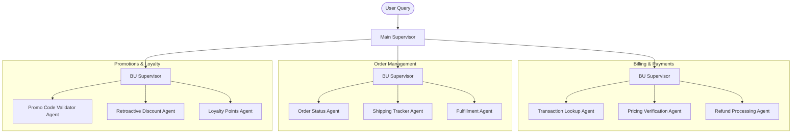

# Ecommerce System

A simple multi-agent ecommerce system built with LangChain and LangGraph. A top-level supervisor routes customer queries to specialized business unit (BU) supervisors that focus on billing & payments, order management, and promotions & loyalty tasks.

## Architecture



## Subgraphs & Tools

All tools use mock data hardcoded for order IDs (`ORD-12345`, `ORD-67890`) and customer IDs (`CUST-001`, `CUST-002`). In production these would query real databases/APIs.

### Billing & Payments

| Agent | Tool | What it does |
|---|---|---|
| Transaction Lookup | `lookup_transaction(order_id)` | Returns transaction ID, charged amount, payment method, date, status |
| Pricing Verification | `verify_pricing(order_id, expected_amount)` | Checks if charged amount matches advertised price; returns discrepancy breakdown |
| | `calculate_price_adjustment(original, discount, tax_rate)` | Recalculates totals after applying a discount |
| Refund Processing | `process_refund(order_id, amount, reason)` | Processes a refund, returns refund ID + 3-5 day timeline |

### Order Management

| Agent | Tool | What it does |
|---|---|---|
| Order Status | `get_order_details(order_id)` | Returns items, status, dates, shipping address, totals |
| | `cancel_order(order_id, reason)` | Cancels if not yet shipped; rejects if already shipped |
| | `update_shipping_address(order_id, address)` | Updates address if order has not yet shipped |
| Shipping Tracker | `track_shipment(order_id)` | Returns carrier, tracking number, current location, tracking history |
| | `get_delivery_estimate(order_id)` | Returns ETA + expedite options (2-day, overnight) with costs |
| Fulfillment | `check_fulfillment_status(order_id)` | Returns warehouse location, picking progress %, stage breakdown |

### Promotions & Loyalty

| Agent | Tool | What it does |
|---|---|---|
| Promo Code Validator | `validate_promo_code(code, order_id?)` | Checks validity, discount type (fixed/%), minimum purchase, expiration, eligible categories |
| Retroactive Discount | `apply_retroactive_discount(order_id, code)` | Validates code, checks eligibility, calculates and applies refund |
| Loyalty Points | `check_loyalty_balance(customer_id)` | Returns points balance, tier (Silver/Gold/Platinum), points to next tier, expiring points |
| | `get_loyalty_history(customer_id)` | Returns full earned/redeemed transaction history |
| | `calculate_points_earned(total, tier)` | Calculates points for a purchase with tier multipliers (1x / 1.5x / 2x) |
| | `redeem_loyalty_points(customer_id, points)` | Redeems points for a discount (100pts = $5), returns redemption code |

## Supervisor Loop — How It Works

Every supervisor (main and BU-level) follows the same loop pattern:

```
FUNCTION supervisor_loop(user_query):

    state.messages = [user_query]

    LOOP:
        # Supervisor thinks
        response = LLM(SYSTEM_PROMPT + state.messages)
        state.messages.append(response)

        IF response has no tool_calls:
            RETURN response  # final answer → END

        # Execute each tool call the LLM requested
        FOR each tool_call in response.tool_calls:

            IF tool_call == "promo_code_validator_agent":
                result = promo_validator_graph.ainvoke(tool_call.args)

            ELIF tool_call == "retroactive_discount_agent":
                result = retroactive_discount_graph.ainvoke(tool_call.args)

            ELIF tool_call == "loyalty_points_agent":
                result = loyalty_points_graph.ainvoke(tool_call.args)

            state.messages.append(ToolMessage(result))

        # Loop back → supervisor sees tool results and decides what to do next
```

### Example — single tool call

```
state = ["Is promo code FALL50 valid?"]

--- Iteration 1 ---
LLM sees:     user query
LLM responds: call promo_code_validator_agent("validate FALL50")

tool executes → result appended to state.messages

--- Iteration 2 ---
LLM sees:     user query + tool result
LLM responds: "Yes, FALL50 gives $50 off orders over $500, valid until Dec 31."
no tool_calls → END
```

### Example — multiple tool calls (parallel)

```
state = ["Apply promo FALL50 to order ORD-12345"]

--- Iteration 1 ---
LLM sees:     user query
LLM responds: call promo_code_validator_agent("validate FALL50")
              call retroactive_discount_agent("apply FALL50 to ORD-12345")

both tools execute → results appended to state.messages

--- Iteration 2 ---
LLM sees:     user query + both tool results
LLM responds: "FALL50 is valid and has been applied. You will receive a $50 refund."
no tool_calls → END
```

## Project Structure
- `main_agent.py`: Main supervisor graph that orchestrates BU supervisors.
- `billing_and_payments/`, `order_management/`, `promotions_and_loyalty/`: BU supervisors and their tools.
- `prompts.py`: System prompts and tool descriptions used by the supervisors.
- `test_agent.ipynb`: Notebook you can use to experiment with the assistant end-to-end.

## Getting Started
1. Install dependencies:
   ```bash
   uv sync
   ```
   or use `pip install -e .` if you prefer standard tooling.
2. Create a `.env` file based on `.env.example` and set any API keys (for example `OPENAI_API_KEY`) and LangSmith settings.

## Usage
- From a Python shell or script, import `graph` from `main_agent.py` and call `await graph.ainvoke({"messages": [...]})` with your conversation history.
- Alternatively, open `test_agent.ipynb` to try the flow interactively.

## LangSmith Tracing
- `.env.example` enables LangSmith tracing by default (`LANGSMITH_TRACING="true"`).
- Set `LANGSMITH_API_KEY` with your workspace token and optionally adjust `LANGSMITH_PROJECT` (defaults to `ecommerce`) to group runs.
- Once configured, every invocation reported through LangSmith includes the full supervisor/tool call tree, which makes it easy to debug agent routing.
- See an example trace [here](https://smith.langchain.com/public/704635b2-8735-4d0d-890f-67c26a5aeae4/r)

## Test Prompts

### Single BU — Order Management
- "Where is my order ORD-99887? It's been 5 days and I haven't received a tracking number."
- "I need to cancel order ORD-44321 before it ships."
- "Can you update the shipping address for order ORD-55123 to 42 Elm Street, Austin TX?"

### Single BU — Billing & Payments
- "I was charged $249 but the product page showed $199. Can you explain the difference?"
- "I need to look up transaction TXN-88321 from last week."
- "I want a refund for order ORD-77654. The item arrived damaged."

### Single BU — Promotions & Loyalty
- "Is promo code SUMMER20 still valid? I want to use it on my next order."
- "I forgot to apply code SAVE10 when I checked out yesterday. Can it be applied retroactively?"
- "How many loyalty points do I have on my account, and can I redeem them?"

### Multi-BU
- "My order ORD-12345 hasn't shipped yet, I was overcharged by $50, and I also have a promo code BLACK30 I forgot to apply."
- "Can you check if my loyalty points were credited for order ORD-67890, and also tell me the current status of that order?"
- "I want a refund for ORD-55555 and I also want to know if the FALL50 promo code applies to my account."

## Notes
- LangGraph CLI support is included; run `langgraph dev` if you want to inspect the graph locally.
