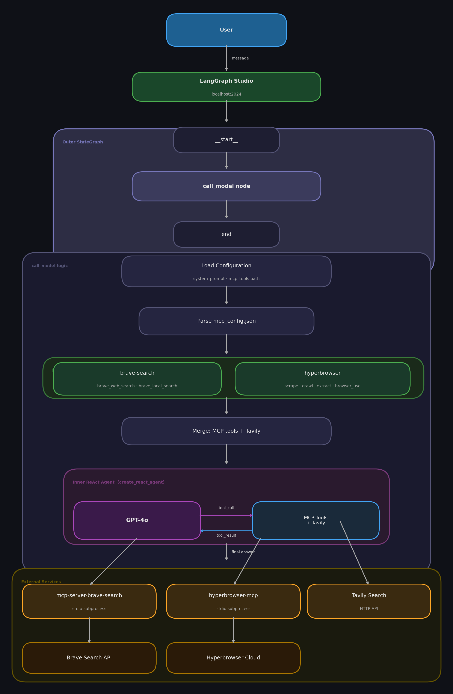

# LangGraph ReAct MCP Chat


A LangGraph-based ReAct agent that connects to any [Model Context Protocol (MCP)](https://modelcontextprotocol.io/) server at runtime. Tools are loaded dynamically from a JSON config file — no code changes needed to add or swap MCP servers.

## Features

- **Dynamic MCP tool loading** — add or swap MCP servers via `mcp_config.json` without touching code
- **`${VAR}` env substitution** — reference environment variables directly in `mcp_config.json`; secrets are resolved at runtime, never hardcoded
- **Built-in Tavily web search** — always available alongside MCP tools
- **Conversation memory** — thread-based history via LangGraph `MemorySaver`; tool results and scraped content persist across turns
- **Docker-first** — run with `docker compose up --build`, no local Node/Python setup required
- **LangGraph Studio compatible** — interact via Studio UI at `http://localhost:2024`

## Bundled MCP Servers

| Server | Transport | What it does |
|---|---|---|
| [Brave Search](https://github.com/modelcontextprotocol/servers/tree/main/src/brave-search) | stdio | Web search via Brave API (2 tools) |
| [Todoist](https://github.com/abhiz123/todoist-mcp) | stdio (npx) | Task management — create, read, update, delete tasks & projects (35 tools) |
| [Firecrawl](https://github.com/mendableai/firecrawl-mcp) | stdio (npx) | Web scraping & crawling via Firecrawl cloud API (15 tools) |
| [Hyperbrowser](https://github.com/hyperbrowserai/mcp) | stdio | Browser automation & web scraping via Hyperbrowser cloud API (10 tools) |

## Architecture



### Key design decisions

- **Two-layer graph** — the outer `StateGraph` is minimal (single node), keeping the graph structure simple while the inner `create_react_agent` handles the full tool-call loop.
- **Per-server MCP isolation** — each MCP server is loaded in its own `try/except`. One failing server does not drop the others.
- **stdio transport** — MCP servers run as subprocesses inside the container. All secrets stay in `.env` and are substituted at runtime via `${VAR}` syntax in `mcp_config.json`.
- **Full message persistence** — `call_model` returns all new messages from the agent (tool calls, tool results, and final response), so scraped content and intermediate results are available in subsequent turns.
- **Volume-mounted `src/`** — code changes are picked up by LangGraph's file watcher without a rebuild.

## Setup

### Docker (recommended)

**1. Configure environment variables**

Create a `.env` file in the project root:

```env
OPENAI_API_KEY=your_openai_api_key
TAVILY_API_KEY=your_tavily_api_key
BRAVE_API_KEY=your_brave_api_key
TODOIST_API_KEY=your_todoist_api_key
FIRECRAWL_API_KEY=your_firecrawl_api_key
HYPERBROWSER_API_KEY=your_hyperbrowser_api_key
LANGSMITH_TRACING=true
LANGSMITH_ENDPOINT=https://api.smith.langchain.com
LANGSMITH_API_KEY=your_langsmith_api_key
LANGSMITH_PROJECT=your_langsmith_project
```

**2. Build and run**

```bash
docker compose up --build
```

Open LangGraph Studio at `http://localhost:2024`.

### Local (without Docker)

```bash
pip install -r requirements.txt
langgraph dev
```

## MCP Configuration

MCP servers are defined in `src/react_agent/mcp_config.json`. Use `${VAR}` syntax to reference environment variables — they are resolved at runtime from the process environment.

```json
{
    "mcpServers": {
        "brave-search": {
            "transport": "stdio",
            "command": "mcp-server-brave-search",
            "args": [],
            "env": {
                "BRAVE_API_KEY": "${BRAVE_API_KEY}"
            }
        },
        "todoist": {
            "transport": "stdio",
            "command": "npx",
            "args": ["-y", "todoist-mcp"],
            "env": {
                "API_KEY": "${TODOIST_API_KEY}"
            }
        },
        "firecrawl": {
            "transport": "stdio",
            "command": "npx",
            "args": ["-y", "firecrawl-mcp"],
            "env": {
                "FIRECRAWL_API_KEY": "${FIRECRAWL_API_KEY}"
            }
        },
        "hyperbrowser": {
            "transport": "stdio",
            "command": "hyperbrowser-mcp",
            "args": [],
            "env": {
                "HYPERBROWSER_API_KEY": "${HYPERBROWSER_API_KEY}"
            }
        }
    }
}
```

### Adding a new MCP server

1. Add its npm package to the `Dockerfile` `npm install -g` line (if npx-based, this step is optional)
2. Add its entry to `mcp_config.json` with `${VAR}` references for any API keys
3. Add the corresponding key to `.env`
4. Rebuild with `docker compose up --build`

> **Note:** Use `docker compose up -d` (not `docker compose restart`) when updating `.env` — restart preserves the old container environment.

## Project Structure

```
.
├── Dockerfile
├── docker-compose.yml
├── langgraph.json
├── pyproject.toml
├── requirements.txt
└── src/
    └── react_agent/
        ├── graph.py          # Outer StateGraph + call_model node
        ├── configuration.py  # Configurable fields (system_prompt, mcp_tools)
        ├── state.py          # State / InputState definitions
        ├── tools.py          # Built-in tools (Tavily)
        ├── prompts.py        # System prompt template
        ├── utils.py          # mcp_config.json loader with ${VAR} resolution
        └── mcp_config.json   # MCP server definitions
```

## Example Prompts

**Web research + task management:**
```
Search for the latest news about Robinhood stock (HOOD) and create a Todoist task 
summarizing the top 3 findings with today's date.
```

**Scrape and analyze:**
```
Use firecrawl to scrape https://finviz.com/quote?t=HOOD&p=d and extract the stock 
stats and all news headlines with their dates.
```

**Follow-up (same thread):**
```
Based on the data you just scraped, analyze the news published since Monday. 
Identify sentiment for each item and give an overall assessment.
```

## License

Apache License 2.0 — see [LICENSE](LICENSE).
