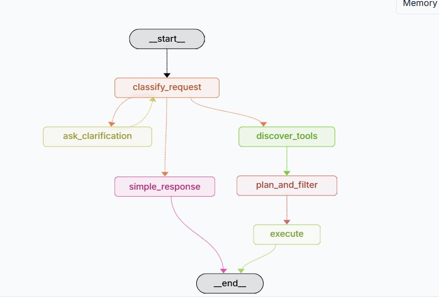

# deepagent_mcp — Agentic MCP Orchestrator

`deepagent_mcp` is the primary agent in this project. Unlike `simple_agent` which performs a single LLM call, this agent **discovers external tools at runtime via MCP, plans how to use them, and executes multi-step tasks autonomously** using the `deepagents` architecture.

## Graph Architecture



The graph has two modes controlled by `enable_advanced_filtering` in [config.py](../src/deepagent_mcp/config.py):

- **Advanced mode (default):** `classify_request → [simple_response | ask_clarification | discover_tools] → plan_and_filter → execute`
- **Basic mode:** `discover_tools → execute`

---

## Node-by-Node Breakdown

### 1. `classify_request`

The entry point. Uses a lightweight LLM call to route the request into one of three buckets:

| Classification | Route | When |
|---|---|---|
| `simple` | → `simple_response` | Greetings, capability questions, no tools needed |
| `clarification` | → `ask_clarification` | Ambiguous or vague requests |
| `execution` | → `discover_tools` | Clear actionable tasks |

This avoids spinning up MCP servers for trivial questions. Defaults to `execution` if classification fails.

### 2. `simple_response` / `ask_clarification`

**simple_response** — answers immediately using the list of available tool names, then exits. No MCP connection made.

**ask_clarification** — asks the user for more detail, then loops back to `classify_request`.

### 3. `discover_mcp_tools`

Connects to every server in `mcp-servers-config.json` via `MultiServerMCPClient` and calls `get_tools()`. Each tool is:

- **Schema-validated** — tools with invalid JSON schemas (e.g. `array` without `items`) are dropped to prevent OpenAI API 400 errors
- **Converted** into `MCPToolInfo` dataclass objects and stored in state as `available_tools`
- **Grouped** by server in `mcp_servers` with connection status

Currently the only configured server is **Playwright** (`@playwright/mcp@latest`), which exposes browser automation tools: navigate, click, fill, screenshot, evaluate JS, and more.

### 4. `plan_and_filter_tools`

Skipped when tool count is below 40 (basic pass-through). When active, runs a **6-stage filtering pipeline** to reduce context bloat:

| Stage | Method | Purpose |
|---|---|---|
| 1 | Keyword pre-filter | Matches request terms against tool categories (email, web, files, etc.) |
| 2 | Semantic similarity | LLM selects relevant tool indices from a numbered list |
| 3 | Relevance scoring | LLM rates each tool 0.0–1.0 against the specific request |
| 4 | Threshold filter | Adaptive threshold (0.1–0.7) based on remaining tool count |
| 5 | Execution plan | LLM creates a step-by-step plan with tool assignments per step |
| 6 | Final selection | Plan-mentioned tools get priority; remaining slots filled by score |

With Playwright's ~20 tools this stage is currently bypassed. It becomes relevant when connecting multiple MCP servers.

### 5. `execute_with_mcp_tools`

The core execution node. It:

1. Reconnects to MCP servers (tool objects don't survive LangGraph state serialization between nodes)
2. Loads actual `BaseTool` objects for the filtered tool set
3. Scopes tools to the single configured server by name prefix to avoid schema conflicts
4. Calls `create_deep_agent(tools, system_prompt, model)` from the `deepagents` library
5. Invokes the agent — it can make **multiple sequential tool calls autonomously** until the task is complete

The agent also has access to a **virtual filesystem** (`files` dict) and **todo tracker** (`todos` list) in state, provided by `deepagents` as built-in scratch space.

---

## State

`MCPOrchestratorState` ([state.py](../src/deepagent_mcp/state.py)) carries the full execution lifecycle across all nodes:

```
messages
  → request_classification
  → available_tools (all discovered tools)
  → filtered_tools (post-planning subset)
  → execution_plan (step descriptions)
  → files (virtual filesystem, persisted across tool calls)
  → todos (task tracker)
  → execution_complete
```

It also tracks human-in-the-loop fields (`approval_required`, `pending_approval`) that can pause the graph before `execute` fires — controlled by `interrupt_before_execution` in config.

---

## Configuration

Key settings in [config.py](../src/deepagent_mcp/config.py):

| Field | Default | Description |
|---|---|---|
| `model` | `openai/gpt-5-nano` | LLM used for classification, planning, and execution |
| `enable_advanced_filtering` | `True` | Enables the full classify → plan → filter pipeline |
| `max_tools_per_step` | `30` | Max tools passed to the execution agent |
| `max_tools_before_filtering` | `50` | Tool count threshold that triggers advanced filtering |
| `interrupt_before_execution` | `False` | Pause graph for human approval before `execute` runs |
| `instructions` | `None` | Custom system prompt prepended to the base prompt |

---

## MCP Servers

Configured in [`mcp-servers-config.json`](../mcp-servers-config.json). Add more servers here to expand the tool set — the discovery, filtering, and execution nodes handle everything automatically.

```json
{
  "playwright": {
    "command": "npx",
    "args": ["@playwright/mcp@latest", "--no-sandbox"],
    "transport": "stdio",
    "description": "Browser interaction and automation"
  },
  "firecrawl": {
    "command": "npx",
    "args": ["-y", "firecrawl-mcp"],
    "transport": "stdio",
    "env": { "FIRECRAWL_API_KEY": "${FIRECRAWL_API_KEY}" },
    "description": "Web scraping, crawling, and converting pages to clean markdown"
  }
}
```

| Server | Tools | Requires |
|---|---|---|
| `playwright` | Browser navigation, click, fill, screenshot, JS evaluation | Node.js |
| `firecrawl` | Scrape URL, crawl site, search web, extract structured data | `FIRECRAWL_API_KEY` env var |
