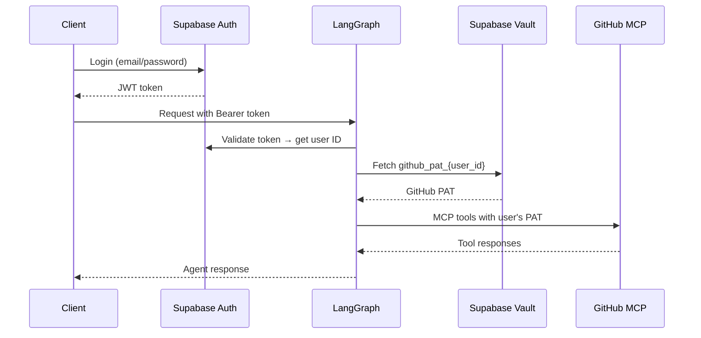

# mcp-auth-demo

Per-user MCP authentication with LangGraph — each user's GitHub tools run under their own credentials, stored securely in Supabase Vault.

## How It Works

```
Client → Supabase Auth → LangGraph middleware → Supabase Vault → GitHub MCP → Agent
```

1. Client authenticates with Supabase and gets a JWT
2. JWT is sent as `Authorization: Bearer <token>` to LangGraph
3. Custom auth middleware validates the token and fetches the user's GitHub PAT from Supabase Vault
4. Agent initializes GitHub MCP tools with that user's PAT
5. All GitHub API calls use the individual user's credentials

## Architecture



## Prerequisites

- Docker + Docker Compose
- Supabase project (free tier works)
- GitHub Personal Access Token with Copilot access
- OpenAI API key
- LangSmith API key

## Setup

### 1. Configure Environment

Copy `.env.example` to `.env` and fill in:

```env
SUPABASE_URL=https://your-project.supabase.co
SUPABASE_SECRET_KEY=sb_secret_...
SUPABASE_PUBLISHABLE_KEY=sb_publishable_...
GITHUB_PAT=ghp_...
OPENAI_API_KEY=sk-...
LANGSMITH_API_KEY=lsv2_...
```

`SUPABASE_SECRET_KEY` maps to the **Secret key** and `SUPABASE_PUBLISHABLE_KEY` to the **Publishable key** in your Supabase project settings.

### 2. Set Up Supabase Vault

Run this SQL in your Supabase **SQL Editor** to create the required Vault helper functions:

```sql
CREATE EXTENSION IF NOT EXISTS supabase_vault WITH SCHEMA vault;

CREATE OR REPLACE FUNCTION vault_create_secret(secret text, name text default null, description text default null)
RETURNS uuid AS $$
BEGIN
  RETURN vault.create_secret(secret, name, description);
END;
$$ LANGUAGE plpgsql SECURITY DEFINER;

CREATE OR REPLACE FUNCTION vault_read_secret(secret_name text)
RETURNS text AS $$
DECLARE result text;
BEGIN
  SELECT decrypted_secret INTO result FROM vault.decrypted_secrets WHERE name = secret_name;
  RETURN result;
END;
$$ LANGUAGE plpgsql SECURITY DEFINER;

CREATE OR REPLACE FUNCTION vault_delete_secret(secret_name text)
RETURNS void AS $$
BEGIN
  DELETE FROM vault.secrets WHERE name = secret_name;
END;
$$ LANGUAGE plpgsql SECURITY DEFINER;
```

### 3. Initialize Database and Secrets

```bash
# Create test users and store GitHub PATs in Vault
docker compose --profile setup run --rm setup
```

This creates two test users (`user1@example.com`, `user2@example.com`, password `testpass123`) and stores the `GITHUB_PAT` from your `.env` in Supabase Vault for each.

### 4. Start the Server

```bash
docker compose up -d
```

### 5. Generate a Token

```bash
# Default: user1@example.com
docker compose --profile token run --rm token

# Specific user
docker compose --profile token run --rm token python generate_supabase_token.py user2@example.com
```

Copy the `Authorization: Bearer <token>` output.

### 6. Test in LangGraph Studio

1. Open LangGraph Studio and connect to `http://localhost:2024`
2. Add the header: `Authorization: Bearer <your-token>`
3. Send a GitHub-related message, e.g. _"What are my most recent repositories?"_

## Project Structure

```
mcp-auth-demo/
├── agent.py              # LangGraph graph with MCP tool loading
├── auth.py               # Custom auth middleware (Supabase JWT validation + Vault)
├── setup_database.py     # Creates Supabase test users
├── setup_secrets.py      # Stores GitHub PATs in Supabase Vault
├── generate_supabase_token.py  # Generates test JWT tokens
├── langgraph.json        # LangGraph server config
├── pyproject.toml
├── Dockerfile
└── docker-compose.yml    # Services: api, setup (profile), token (profile)
```

## Troubleshooting

**"Could not find function vault_create_secret"** — Run the SQL setup from Step 2.

**"Invalid login credentials"** — The test users don't exist yet; run the setup profile first.

**"No assistants found" in Studio** — The auth token is missing or invalid. Regenerate it with the token profile.

**MCP tools not loading** — Verify your GitHub PAT has Copilot access and is stored in Vault (check Supabase Dashboard → Vault).
