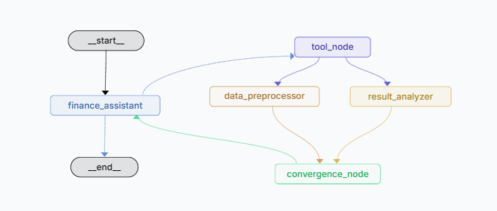
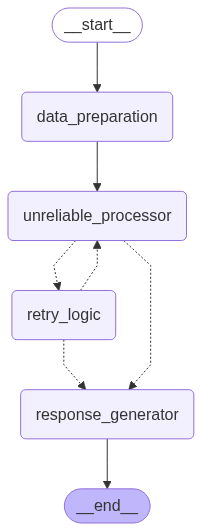

# LangGraph Fault Tolerance — LangGraph Platform

This project is a **LangGraph Platform-ready** version of the [fault-tolerance](../fault-tolerance) demo. The graphs are compiled without a checkpointer so the platform can inject its own persistence layer.

It exposes two graphs via `langgraph.json`:

| Graph | Entry point | What it shows |
|-------|-------------|---------------|
| `partial_failure` | `agents/partial_failure_agent.py:graph` | Parallel branch partial failure with pending writes |
| `retry` | `agents/retry_agent.py:graph` | Progressive retry logic with tiered fallbacks |

## Difference from the base project

The only difference from the [`fault-tolerance`](../fault-tolerance) variant is that graphs here are compiled without a checkpointer:

```python
# fault-tolerance (local): SQLite checkpointer wired manually
graph = builder.compile(checkpointer=setup_checkpointer())

# fault-tolerance-langsmith (platform): checkpointer injected by the platform
graph = builder.compile()
```

Everything else — state definitions, nodes, edges, retry logic — is identical.

## Demo 1: Partial Failure with Pending Writes



When two nodes run in parallel and one fails, LangGraph stores the successful node's output as a **pending write**. On resume, only the failed node re-runs — the successful node is skipped entirely.

**Execution flow:**
1. `finance_assistant` calls tools to retrieve contract data
2. `data_preprocessor` and `result_analyzer` run in parallel
3. `result_analyzer` fails on first attempt
4. Platform saves `data_preprocessor`'s write as pending
5. On resume, only `result_analyzer` re-runs
6. Both writes merge at `convergence_node`

## Demo 2: Retry Logic with Fallbacks



Handles unreliable operations with a three-tier fallback strategy:

| Tier | Attempts | Strategy |
|------|----------|----------|
| 1 | 1–3 | Direct retry |
| 2 | 4–5 | Simplify input and retry |
| 3 | 6+ | Skip processing, use default result |

## Running locally with `langgraph dev`

```bash
pip install -r requirements.txt
cp .env.example .env  # add OPENAI_API_KEY
langgraph dev
```

The dev server starts at `http://localhost:8123` and injects an in-memory checkpointer automatically.

## Deploying to LangGraph Platform

> **Note:** LangGraph Platform Cloud requires a paid LangSmith plan. Enable it at [smith.langchain.com/host/deployments](https://smith.langchain.com/host/deployments) before running the deploy command.

```bash
langgraph build
langgraph deploy --name fault-tolerance-langsmith
```

Once deployed, interact with the graphs via the LangGraph API or LangSmith UI using the graph names `partial_failure` and `retry`.

### Free alternative — self-hosted with Docker

```bash
langgraph build -t fault-tolerance-langsmith
docker run -p 8123:8123 fault-tolerance-langsmith
```

## Environment variables

| Variable | Required | Description |
|----------|----------|-------------|
| `OPENAI_API_KEY` | Yes | Used by `partial_failure` graph |
