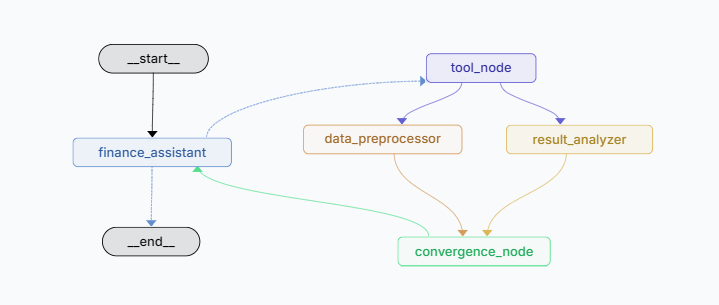
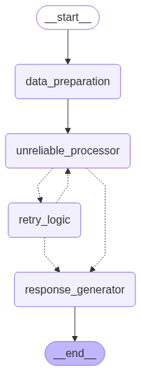
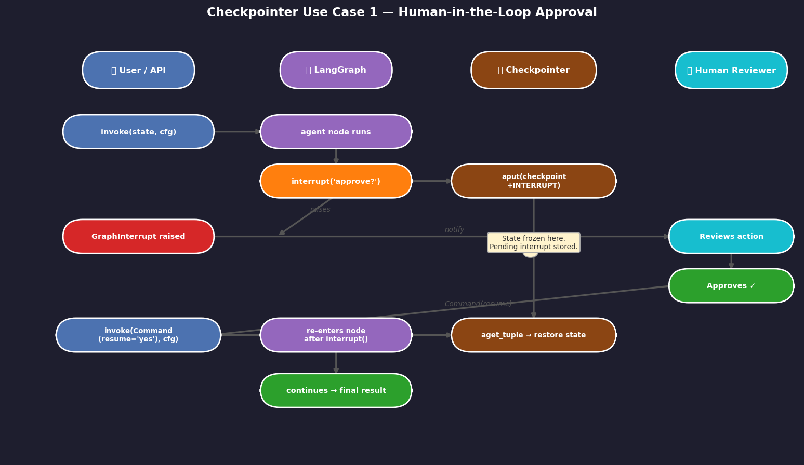
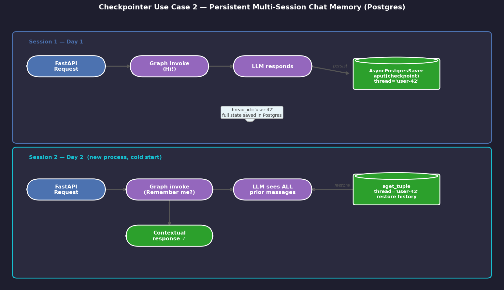
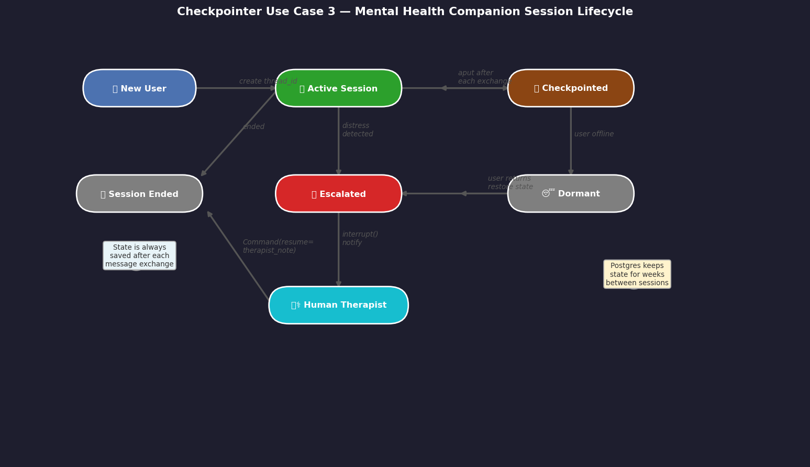
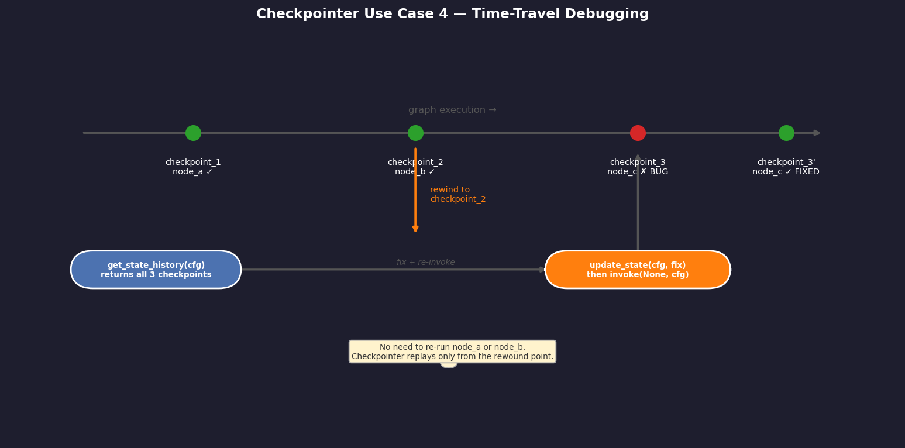
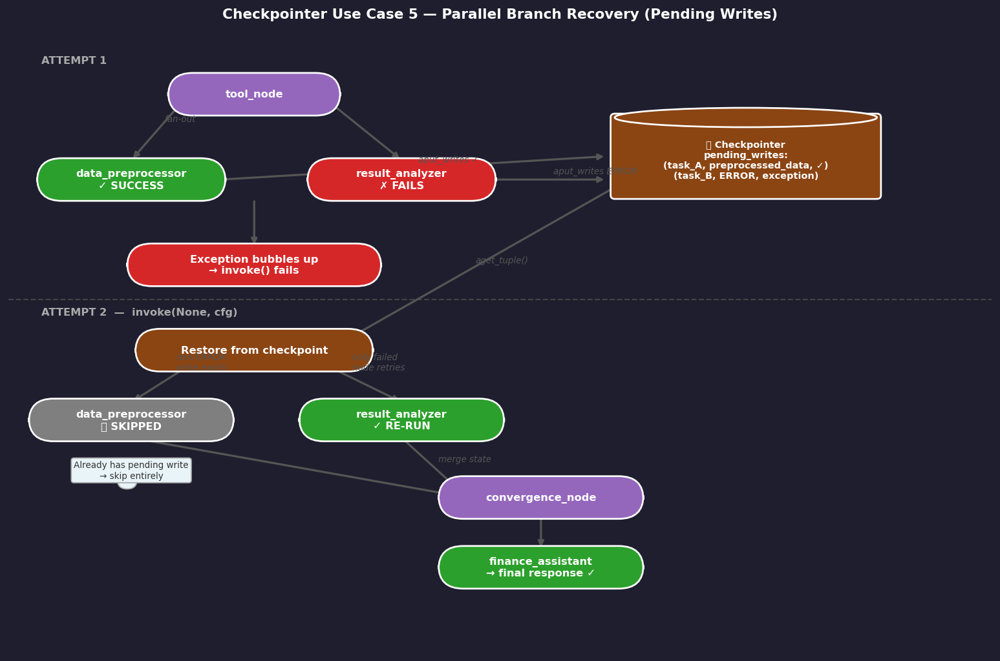

# LangGraph Fault Tolerance

This project demonstrates **LangGraph's fault tolerance mechanisms** through two patterns that handle different types of failures in LangGraph workflows.

## Demo 1: Partial Failure with Pending Writes (`agents/partial_failure_agent.py`)

Demonstrates how LangGraph handles **parallel execution failures** using pending writes.

### What This Solves
When multiple nodes run in parallel, some may succeed while others fail. LangGraph's fault tolerance ensures that:

- **Successful work is preserved** - Completed nodes' outputs are saved as "pending writes"
- **Only failed nodes retry** - Successful nodes don't re-execute on resume
- **Atomic state updates** - All writes are applied together using reducer functions
- **No lost progress** - Expensive operations (LLM calls, API requests) aren't repeated

### Agent Graph



*Figure 1: LangGraph fault tolerance workflow with parallel processing*

### Execution Sequence:

1. **Initial Request**: User asks to "Analyze top 3 contracts and multiply largest by π"
2. **Tool Execution**: LLM calls `get_finance_data` to retrieve contract information
3. **Parallel Processing**: Two nodes run simultaneously:
   - `data_preprocessor`: Always succeeds, writes preprocessing results
   - `result_analyzer`: Fails on first attempt (simulated)
4. **Fault Tolerance Activates**: 
   - LangGraph detects partial failure
   - Saves `data_preprocessor`'s successful write as "pending"
   - Creates checkpoint without losing work
5. **Resume & Recovery**:
   - Only `result_analyzer` re-runs (succeeds this time)
   - Pending write from `data_preprocessor` is merged with new write
   - Workflow continues from convergence point
6. **Final Response**: LLM provides complete analysis without re-doing expensive work

## Demo 2: Retry Logic with Fallbacks (`agents/retry_agent.py`)

Demonstrates **different retry strategies** for unreliable operations with progressive fallback approaches.

### What This Solves
Handles operations that fail intermittently (API timeouts, service unavailability, rate limits) with:

- **Progressive retry logic** - Multiple attempts with backoff
- **Fallback strategies** - Alternative approaches when retries fail
- **Graceful degradation** - Continue workflow even when processing fails
- **User communication** - Clear status updates about processing outcome

### Agent Graph



*Figure 2: LangGraph retry workflow with various retry strategies*

### Retry Strategy Tiers:

1. **Tier 1 (Retries 1-3)**: Direct retry of same operation
2. **Tier 2 (Retries 4-5)**: Fallback A - Simplify input and retry
3. **Tier 3 (Retry 6+)**: Fallback B - Skip processing, use default result

### Example Output Flow:
```
[ATTEMPT 1-3] Direct retries with complex input → FAIL
[ATTEMPT 4-5] Simplified input fallback → FAIL  
[ATTEMPT 6+] Default result fallback → SUCCESS (graceful degradation)
```

## Technical Implementation

### Reducer Functions (Demo 1)
```python
def merge_dicts(left: dict, right: dict) -> dict:
    """Handles concurrent writes to the same state key"""
    return {**left, **right}  # Merges dictionaries safely

class State(TypedDict):
    messages: Annotated[list[AnyMessage], add_messages] # Uses add_messages reducer
    ...
    intermediate_results: Annotated[dict, merge_dicts]  # Uses merge_dicts reducer
```

### Checkpointing
- **SQLite-based persistence** preserves state across failures
- **Unique thread IDs** isolate different execution contexts
- **Pending writes** stored separately until all parallel nodes complete

## When to Use Each Resilience Pattern

### Use `RetryPolicy` when...

The failure is **transient and fast to recover** — API rate limits, network timeouts, LLM provider blips:

```python
from langgraph.types import RetryPolicy

builder.add_node("call_llm", call_llm, retry=RetryPolicy(
    max_attempts=5,
    retry_on=openai.RateLimitError
))
```

Retries happen **within the same execution**, in memory. No checkpointer needed. If the process crashes mid-retry, those retries are lost.

### Use checkpointer + `graph.invoke(None, cfg)` when...

The failure is **infrastructure-level or long-running** — process crash, long pipelines, human intervention needed, or parallel branches where one succeeds and one fails (this demo's case):

```python
graph = builder.compile(checkpointer=MemorySaver())

try:
    graph.invoke(state, cfg)
except Exception:
    pass  # progress is saved in checkpoint

# Resume later — even after a process restart if using Postgres/SQLite
graph.invoke(None, cfg)
```

### Use **both together** for maximum resilience

```python
builder.add_node(
    "call_external_api",
    call_external_api,
    retry=RetryPolicy(max_attempts=3)  # handles transient blips
)
graph = builder.compile(checkpointer=checkpointer)  # handles crashes
```

`RetryPolicy` silently handles fast transient errors. If all retries are exhausted and the node still fails, the checkpointer saves progress so you can resume from that checkpoint later.

### Decision guide

| Scenario | Pattern |
|---|---|
| API timeout / rate limit | `RetryPolicy` |
| Process crash mid-pipeline | Checkpointer + resume |
| Parallel branch partial failure | Checkpointer + pending writes (this demo) |
| Long job (>minutes) | Checkpointer + resume |
| Human approval before continuing | Checkpointer + `interrupt` |
| Transient + crash resilience | Both together |

## Checkpointer Use Cases in Practice

### Use Case 1 — Human-in-the-Loop Approval



A node calls `interrupt()` to pause execution mid-graph and surface a decision to a human. The checkpointer saves all state at that point. When the human responds (minutes or days later), `graph.invoke(Command(resume=decision), cfg)` restores the checkpoint and continues from exactly where it stopped — no recomputation of earlier nodes.

**When to use:** Any workflow requiring human sign-off before a consequential action (send email, execute trade, deploy to prod).

---

### Use Case 2 — Multi-Session Memory with Postgres



`AsyncPostgresSaver` persists the full conversation state to a Postgres table keyed by `thread_id`. A second session (different process, different day) loads the same `thread_id` and resumes with full prior context — no external vector store needed for conversation history.

**When to use:** Customer support bots, long-running assistants, or any agent that must remember prior sessions across restarts.

---

### Use Case 3 — Mental Health Companion Lifecycle



A companion agent progresses through states (NewUser → ActiveSession → Checkpointed → Dormant → Escalated). Each state transition is checkpointed so the agent can resume a conversation after days of inactivity and recognise when to escalate to a human therapist — without losing the user's history.

**When to use:** Sensitive long-running applications where continuity of context and graceful escalation to humans are both required.

---

### Use Case 4 — Time-Travel Debugging



`graph.get_state_history(cfg)` lists every checkpoint ever created for a thread. You can rewind to any prior checkpoint and re-invoke the graph with a corrected state or different inputs — the original "bad" branch is preserved, and a new branch forks from the rewind point.

**When to use:** Development and debugging of long pipelines, A/B testing alternative prompt strategies, or correcting a mistake in a multi-step agentic workflow without restarting from scratch.

---

### Use Case 5 — Parallel Branch Partial Failure (this demo)



When two nodes run in parallel and one fails, LangGraph stores the successful node's output as a "pending write" in the checkpoint. On resume, the pending write is replayed and only the failed node re-executes — the successful node is skipped entirely. Both writes are merged atomically at the convergence point.

**When to use:** Fan-out/fan-in graphs, multi-agent pipelines, or any workflow with parallel branches where re-running successful (and potentially expensive) nodes would be wasteful.

---

## Real-World Applications

### Partial Failure Pattern
- **Multi-agent systems**: Preserve work when some agents fail
- **Data pipelines**: Process large datasets in fault-tolerant chunks
- **API integrations**: Handle partial service outages
- **Distributed processing**: Ensure consistency across parallel operations

### Retry Logic Pattern
- **External API calls**: Handle rate limits and timeouts
- **LLM workflows**: Manage model failures and retries
- **Database operations**: Recover from connection issues
- **File processing**: Handle temporary I/O failures